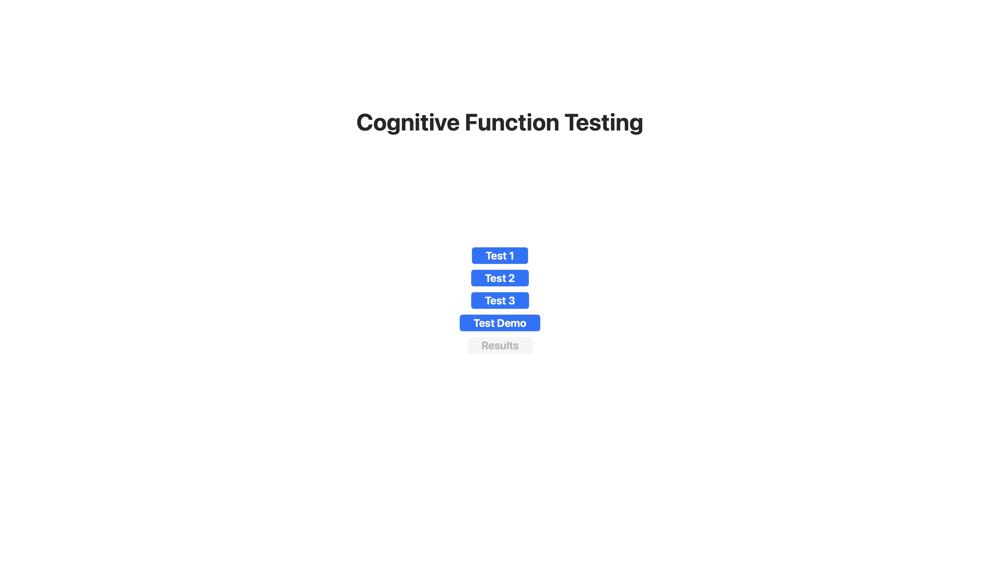
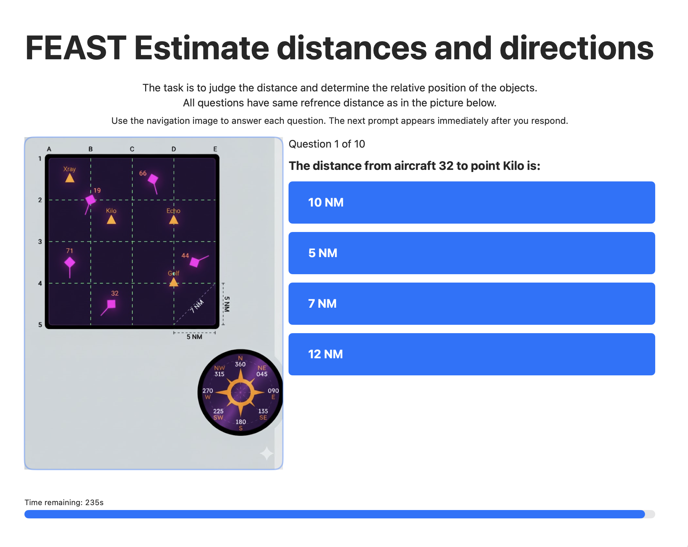
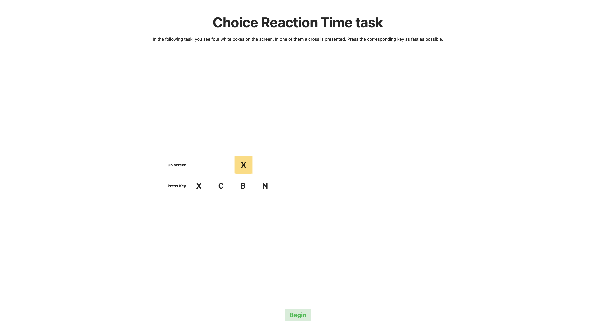
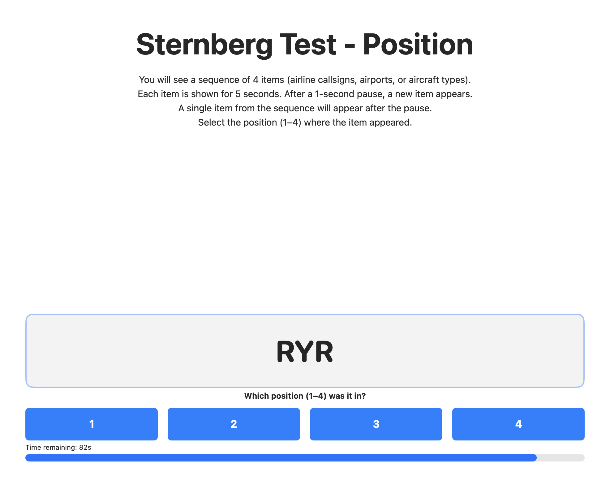
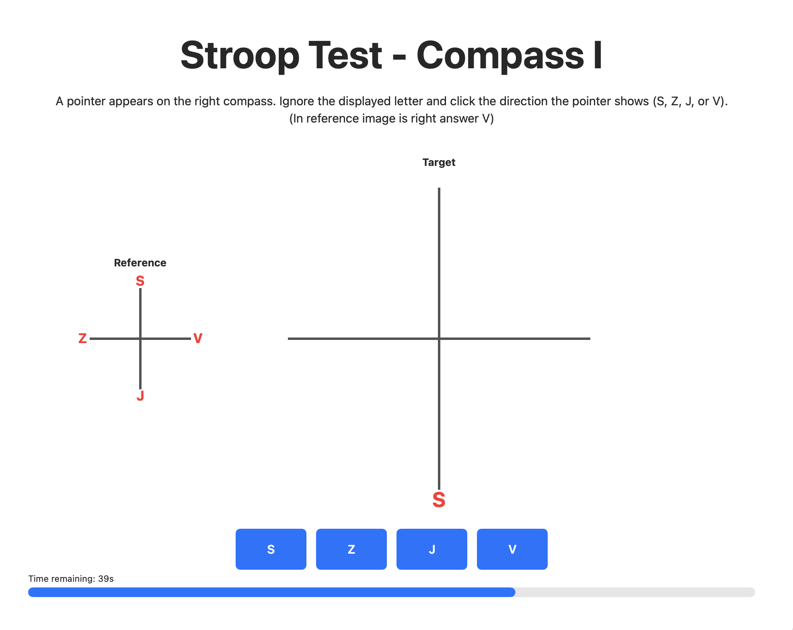

# bp-cognitive-app

## 🇨🇿 O projektu
MacOS aplikace pro experimentální testování kognitivních funkcí v závislosti na hladině glukózy v krvi.  
Vyvinuto jako praktická část bakalářské práce na **ČVUT – Fakulta dopravní**.

Aplikace slouží jako výzkumný nástroj pro provádění kognitivních testů a ukládání výsledků pro následnou analýzu.

### Funkce
- test reakčního času  
- test pozornosti  
- rozhodovací testy (YES/NO)  
- poziční a orientační testy  
- ukládání výsledků lokálně  
- experimentální použití pro akademický výzkum  

---

## 📸 Screenshoty

### Hlavní obrazovka

### FEAST-style test

### Choice test

### YES/NO test

### Position test

### Compass test

---

## 🇬🇧 About
macOS application for experimental testing of cognitive functions in relation to blood glucose levels.  
Developed as the practical part of a bachelor’s thesis at the **Czech Technical University in Prague – Faculty of Transportation Sciences**.

The app serves as a research tool for running cognitive tests and storing results for later analysis.

### Features
- reaction time testing  
- attention tests  
- decision making tasks  
- orientation/position tests  
- local result storage  
- academic research use  

---

## Tech
- Swift  
- SwiftUI  
- Local data storage 

---

## Purpose
This project is part of an academic bachelor thesis and is intended for research and demonstration purposes only.  
Not a production medical or diagnostic tool.
